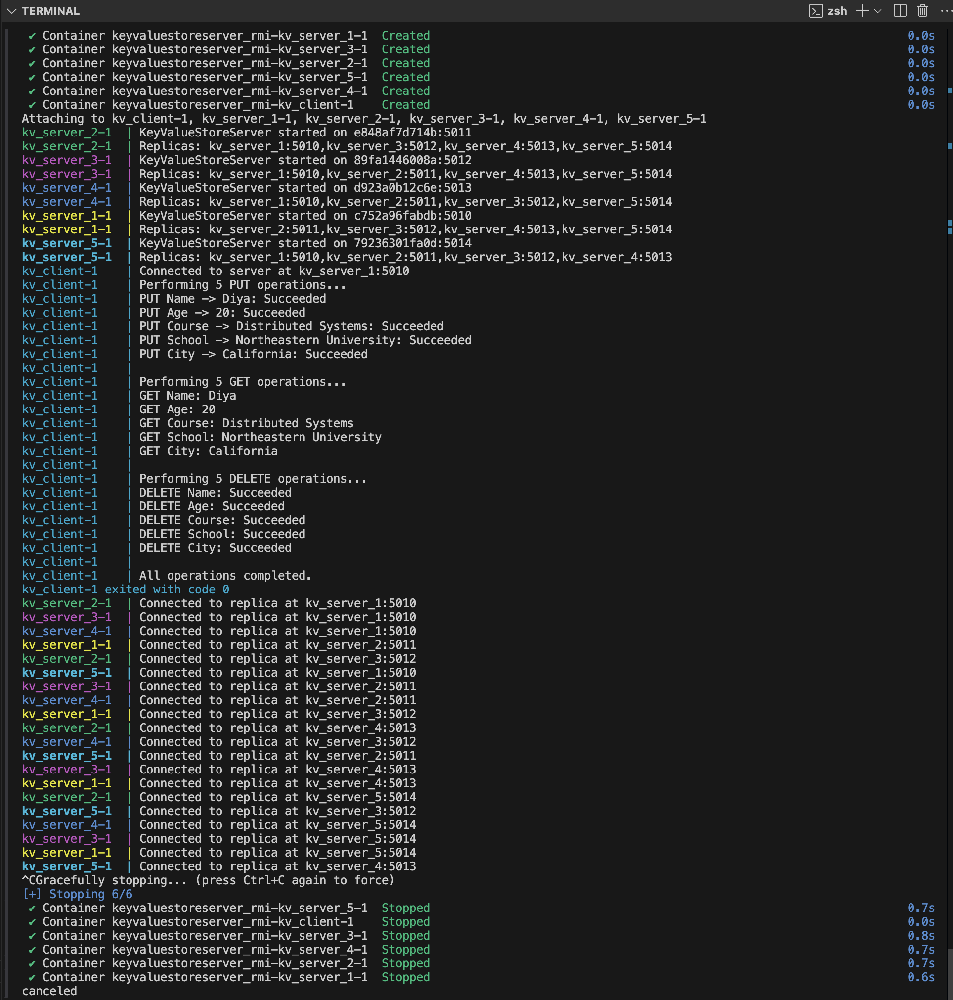
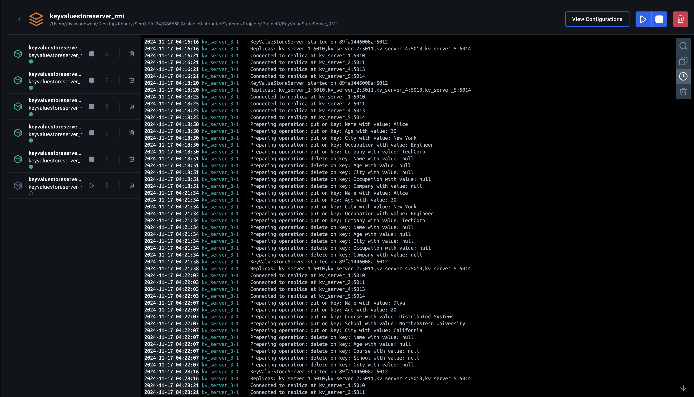
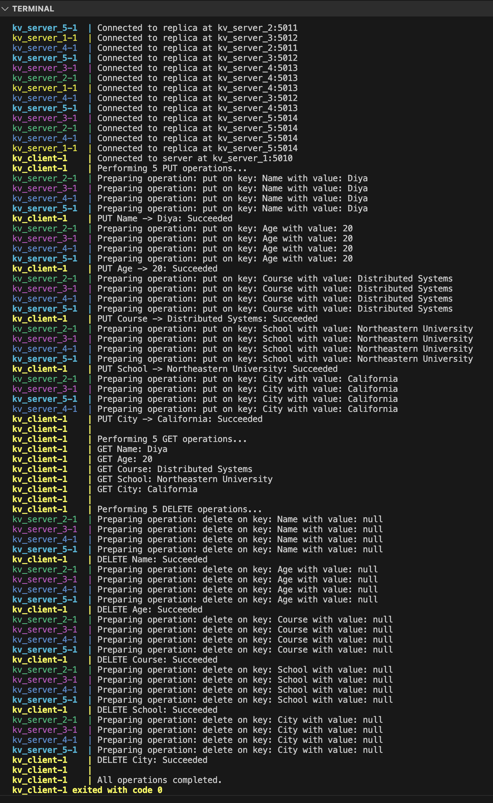
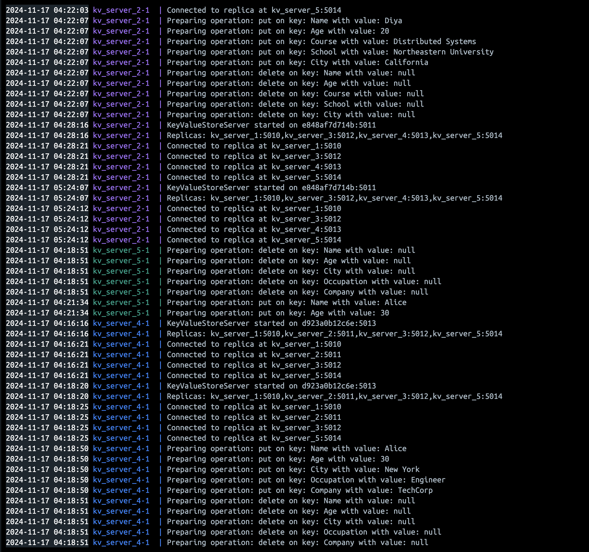

# KeyValueStoreServer RMI

## Overview

The **KeyValueStoreServer RMI** project is a distributed key-value store implemented using Java's Remote Method Invocation (RMI). The system supports basic CRUD operations (`GET`, `PUT`, and `DELETE`) across multiple replicas in a distributed environment, ensuring data consistency through a two-phase commit protocol.

This project demonstrates key distributed systems concepts, including replication, fault tolerance, and consistency.

---

## Features

- **CRUD Operations**: `GET`, `PUT`, and `DELETE` key-value pairs.
- **Replication**: Data is replicated across multiple servers for fault tolerance.
- **Two-Phase Commit Protocol**: Ensures consistency across replicas for all operations.
- **Client-Server Communication**: The client communicates with one server, which replicates operations to all connected replicas.
- **Dynamic Replica Management**: Servers automatically connect to their replicas at startup.

---

## Architecture

- **Servers**:
  - Hosts the key-value store and replicates data to other servers.
  - Implements the two-phase commit protocol for operation consistency.
- **Client**:
  - A command-line interface (CLI) for performing `PUT`, `GET`, and `DELETE` operations.
  - Interacts with a single server, which handles replication.

---

## Components

### 1. **KeyValueStoreInterface.java**

Defines the remote methods that can be invoked on a server:

- `String get(String key)`
- `boolean put(String key, String value)`
- `boolean delete(String key)`
- `boolean prepare(String operation, String key, String value)`
- `boolean commit(String operation, String key, String value)`

### 2. **KeyValueStoreServer.java**

Implements the `KeyValueStoreInterface` and handles:

- CRUD operations on the local key-value store.
- Replication of operations to connected replicas.
- Logging of all operations, including which server is preparing or committing operations.

### 3. **KeyValueStoreClient.java**

Provides a CLI to:

- Perform operations (`GET`, `PUT`, `DELETE`).
- Display results of operations.
- Test the system by performing multiple operations.

### 4. **docker-compose.yml**

Defines the multi-container setup for the system using Docker Compose:

- Each server is a container with a unique port.
- A single client interacts with the servers.

---

## Requirements

- **Java 17+**
- **Docker** (for containerization)
- **Docker Compose** (for orchestration)

---

## Setup and Execution

### 1. **Clone the Repository**

```bash
git clone https://github.com/DiyaWadhwani/KeyValueStoreServer_RMI.git
cd KeyValueStoreServer_RMI
git checkout server_replication-2pc
```

### 2. **Build and Run with Docker Compose**

```bash
docker-compose up --build
```

### 3. **Run the Client**

Head to Docker, and run the client container to view logs and interact with the system.

---

## Operations Performed

### PUT Operations

```plaintext
Performing 5 PUT operations...
PUT Name -> Diya: Succeeded
PUT Age -> 20: Succeeded
PUT Course -> Distributed Systems: Succeeded
PUT School -> Northeastern University: Succeeded
PUT City -> California: Succeeded
```

### GET Operations

```plaintext
Performing 5 GET operations...
GET Name: Diya
GET Age: 20
GET Course: Distributed Systems
GET School: Northeastern University
GET City: California
```

### DELETE Operations

```plaintext
Performing 5 DELETE operations...
DELETE Name: Succeeded
DELETE Age: Succeeded
DELETE Course: Succeeded
DELETE School: Succeeded
DELETE City: Succeeded
```

---

## Environment Variables

- **`PORT`**: The port number for the server.
- **`REPLICAS`**: A comma-separated list of replica servers in the format `hostname:port`.

---

## Log Outputs

- **Terminal Logs on Building Docker Compose file**:



- **Docker Logs on Building Docker Compose file from Terminal**:



- **Terminal Logs on Running Client from Docker**:



- **Docker Logs on Running Client**:



---

## Acknowledgments

This project was developed to demonstrate concepts in distributed systems, fault tolerance, and data replication.

---

## License

This project is licensed under the MIT License. See the `LICENSE` file for details.
