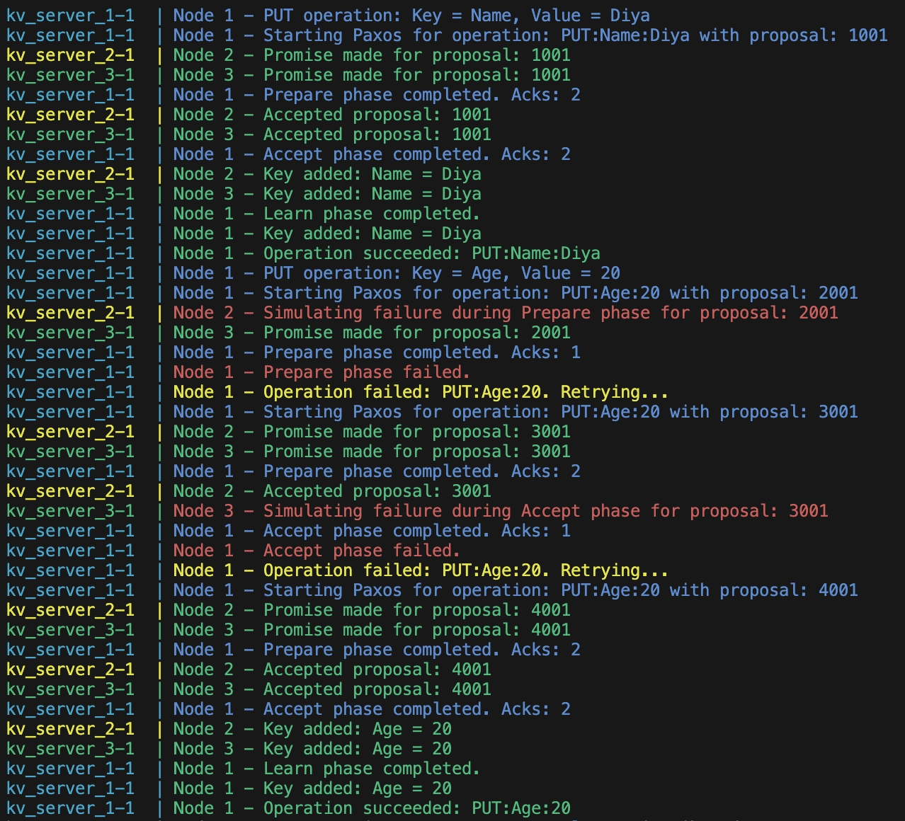
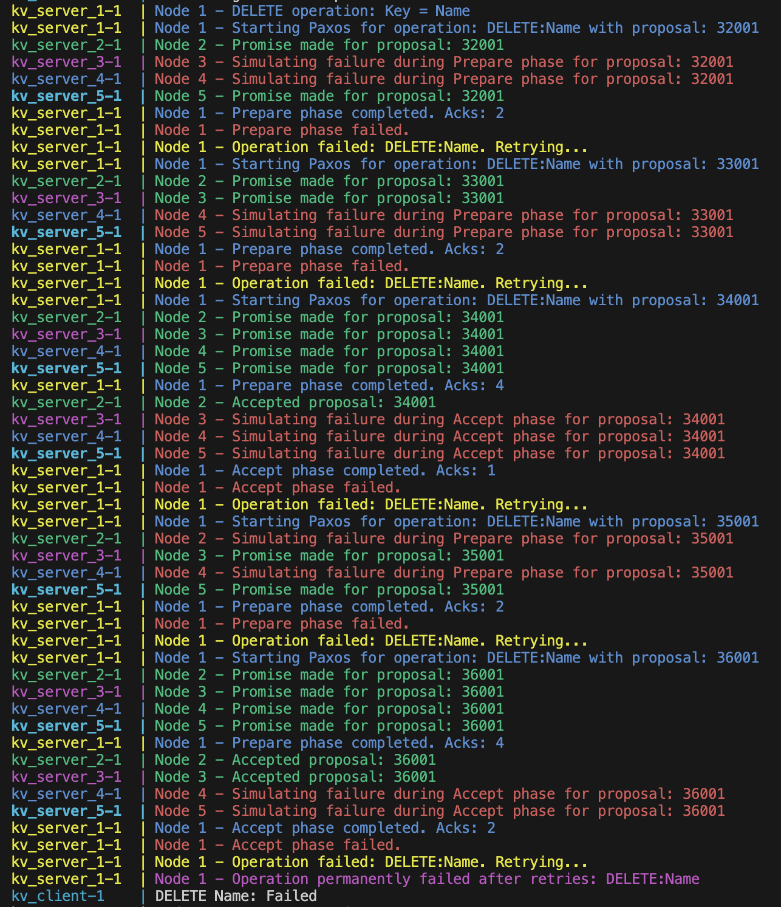

# KeyValueStoreServer RMI - Paxos Implementation

## Overview

The **KeyValueStoreServer RMI** project is a distributed key-value store implemented using Java's Remote Method Invocation (RMI). The system supports basic CRUD operations (`GET`, `PUT`, and `DELETE`) across multiple replicas in a distributed environment, ensuring data consistency and fault tolerance through the Paxos consensus protocol.

This project demonstrates key distributed systems concepts, including replication, fault tolerance, and consistency.

## Features

- **CRUD Operations**: `GET`, `PUT`, and `DELETE` key-value pairs.
- **Replication**: Data is replicated across multiple servers for fault tolerance.
- **Paxos Consensus Protocol**: Ensures consistency across replicas for all operations while tolerating server failures.
- **Client-Server Communication**: The client communicates with one server, which ensures consensus across all connected replicas using Paxos.
- **Fault Tolerance**: Simulates node failures in the Prepare and Accept phases of Paxos to test recovery and retries.
- **Dynamic Proposal Management**: Each server maintains unique proposal numbers to support the Paxos protocol.

## Architecture

- **Servers**:
  - Hosts the key-value store and replicates data to other servers.
  - Implements the Paxos protocol for operation consistency and fault tolerance.
  - Simulates failures in the Paxos roles (Proposers, Acceptors) for robustness testing.
- **Client**:
  - A command-line interface (CLI) for performing `PUT`, `GET`, and `DELETE` operations.
  - Interacts with a single server, which ensures consistency via Paxos.

## Components

### 1. **KeyValueStoreInterface.java**

Defines the remote methods that can be invoked on a server:

- `String get(String key)`
- `boolean put(String key, String value)`
- `boolean delete(String key)`
- `boolean prepare(int proposalNumber, String operation)`
- `boolean accept(int proposalNumber, String operation)`
- `void learn(String operation)`

### 2. **KeyValueStoreServer.java**

Implements the `KeyValueStoreInterface` and handles:

- CRUD operations on the local key-value store.
- Paxos roles:
  - Proposer: Initiates the consensus process by generating proposals.
  - Acceptor: Promises and accepts proposals while tolerating failures.
  - Learner: Finalizes and applies the consensus outcome to the local key-value store.
- Logging of all operations, including Paxos phases and retries.

### 3. **KeyValueStoreClient.java**

Provides a CLI to:

- Perform operations (`GET`, `PUT`, `DELETE`).
- Display results of operations.
- Test the system by performing multiple operations.

### 4. **docker-compose.yml**

Defines the multi-container setup for the system using Docker Compose:

- Each server is a container with a unique port.
- A single client interacts with the servers.

## Requirements

- **Java 17+**
- **Docker** (for containerization)
- **Docker Compose** (for orchestration)

## Setup and Execution

### 1. **Clone the Repository**

```bash
git clone https://github.com/DiyaWadhwani/KeyValueStoreServer_RMI.git
git checkout paxos-impl
```

### 2. **Build and Run with Docker Compose**

```bash
docker-compose up --build
```

### 3. **Run the Client**

Head to Docker, and run the client container to view logs.

## Operations Performed

### PUT Operations

```plaintext
Performing 5 PUT operations...
PUT Name -> Diya: Succeeded
PUT Age -> 20: Succeeded (after 2 retries due to simulated failures)
PUT Course -> Distributed Systems: Succeeded
PUT School -> Northeastern University: Succeeded (after 3 retries due to simulated failures)
PUT City -> California: Succeeded (after 4 retries due to simulated failures)
```

### GET Operations

```plaintext
Performing 5 GET operations...
GET Name: Diya
GET Age: 20
GET Course: Distributed Systems
GET School: Northeastern University
GET City: California
```

### DELETE Operations

```plaintext
Performing 5 DELETE operations...
DELETE Name: Succeeded
DELETE Age: Succeeded (after 1 retry due to simulated failures)
DELETE Course: Succeeded
DELETE School: Failed after 5 retries (quorum not achieved)
DELETE City: Succeeded (after 3 retries due to simulated failures)
```

## Paxos Implementation Details

1. Proposer:

   - Generates unique, monotonically increasing proposal numbers.
   - Retries with higher proposal numbers when consensus fails.

2. Acceptor:

   - Responds to Prepare and Accept requests.
   - Simulates failures with a 40% probability during both phases.

3. Learner:

   - Applies the agreed-upon operations to the key-value store after consensus.

4. Retry Mechanism:
   - Operations are retried up to 5 times with new proposals upon failure in any phase.

## Log Outputs

**Example Paxos Failure and Retry Logs**

### PUT Operation with Simulated Failures



### DELETE Operation with Failure and Permanent Failure



## Environment Variables

- **`PORT`**: The port number for the server.
- **`REPLICAS`**: A comma-separated list of replica servers in the format `hostname:port`.

## Fault Tolerance Simulation

- Simulated failures are implemented for:
  - Prepare phase in Paxos (20% probability).
  - Accept phase in Paxos (40% probability).
- The system retries failed operations with new proposals, ensuring eventual consistency as long as a quorum is reached.

## Acknowledgments

This project was developed to demonstrate concepts in distributed systems, fault tolerance, and data replication.

## License

This project is licensed under the MIT License. See the `LICENSE` file for details.
